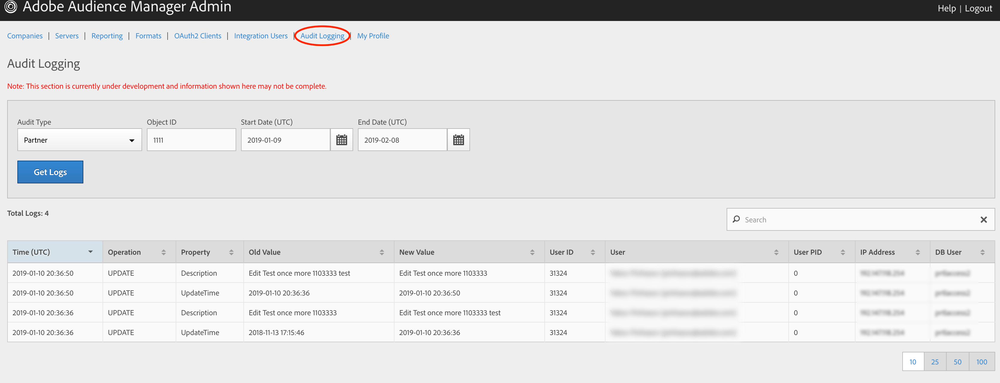

# 감사 로깅 {#audit-logging}

고객 문제를 [!UICONTROL  Audit Logging] 디버깅할 때 가장 먼저 사용할 수 있습니다.

>[!NOTE]
>
>이 [!UICONTROL Audit Logging] 기능 및 문서는 현재 개발 중이며 변경될 수 있습니다. ( [!DNL JIRA][!DNL UI] 팀)에서 발생하는 문제를 모두 기록하십시오.

<!-- 

In the **Audit Type** drop-down selector, choose between:

* [!UICONTROL Partner]
* [!UICONTROL User]
* [!UICONTROL Group]
* [!UICONTROL Datasource Summary]
* [!UICONTROL General Datasource]
* [!UICONTROL Merge Rule Datasource]
* [!UICONTROL Data Feed]
* [!UICONTROL Data Feed Subscription]
* [!UICONTROL Trait Summary]
* [!UICONTROL Trait Rule]
* [!UICONTROL Segment Summary]
* [!UICONTROL Destination Summary]
* [!UICONTROL Server to Server Destination]
* [!UICONTROL Derived Signal]
* [!UICONTROL Model]
* [!UICONTROL Segment Test Group]

The **Object ID** is the ID of the item you're researching. See the table below for which ID corresponds to the Object ID in each case:

Audit Type | Object ID |
---------|----------|
 [!UICONTROL Partner] | Partner ID - PID |
 [!UICONTROL User] | User ID |
 [!UICONTROL Group] | B3 |
 [!UICONTROL Datasource Summary] | Data Source ID |
 [!UICONTROL General Datasource] | Data Source ID |
 [!UICONTROL Merge Rule Datasource] | Data Source ID |
 [!UICONTROL Data Feed] | Data Feed ID |
 [!UICONTROL Data Feed Subscription] | Data Feed ID |
 [!UICONTROL Trait Summary] | SID (trait) |
 [!UICONTROL Trait Rule] | SID (trait) |
 [!UICONTROL Segment Summary] |  |
 [!UICONTROL Destination Summary] |  |
 [!UICONTROL Server-to-Server Destination]| N/A |
 [!UICONTROL Derived Signal] | N/A |
 [!UICONTROL Model] | N/A |
 [!UICONTROL Segment Test Group] | N/A |

 Use [!UICONTROL Start Date] ([!DNL UTC]) and [!UICONTROL End Date] ([!DNL UTC]) to narrow down the time interval of the logs.

 -->