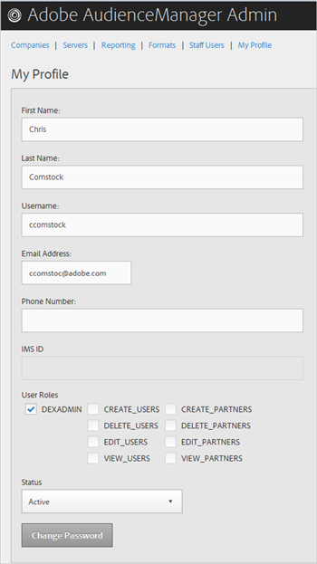
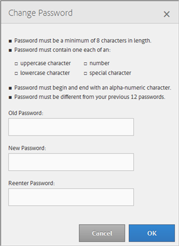

# 내 프로필 {#my-profile}

Audience Manager 관리 도구 프로필의 세부 사항을 편집하거나 암호를 변경합니다.

<!-- c_my_profile.xml -->

## 프로필 편집 {#edit-profile}

이름과 성, 사용자 이름, 이메일 주소, 전화 번호, 사용자 역할 및 상태를 포함하여 Audience Manager 관리 도구 프로필을 보고 편집합니다. [!UICONTROL IMS ID]

<!-- t_edit_profile.xml -->

1. 클릭 **[!UICONTROL My Profile]**.

   

2. 다음 필드를 채웁니다.
   * **[!UICONTROL First Name]** :(필수) 이름을 지정합니다.
   * **[!UICONTROL Last Name]** :(필수) 성을 지정합니다.
   * **[!UICONTROL Username]** :(필수) 첫 번째 사용자 이름을 지정합니다.
   * **[!UICONTROL Email Address]** :(필수) 이메일 주소를 지정합니다.
   * **[!UICONTROL Phone Number]** :전화 번호를 지정합니다.
   * **[!UICONTROL IMS ID]** :인터넷 메시지 서비스 ID를 지정합니다.
   * **[!UICONTROL User Roles]** :원하는 사용자 역할을 선택합니다.
      * **[!UICONTROL DEXADMIN]** :Audience Manager 관리 도구에서 작업을 수행하기 위한 관리자 액세스 권한을 제공합니다. 이 옵션을 선택하지 않으면 개별 역할을 선택할 수 있습니다. 이러한 역할을 통해 사용자는 [!DNL API] 호출을 사용하여 작업을 수행할 수 있지만 관리 도구에서는 수행할 수 없습니다.
      * **[!UICONTROL CREATE_USERS]** :사용자가 [!DNL API] 호출을 사용하여 새 사용자를 만들 수 있습니다.
      * **[!UICONTROL DELETE_USERS]** :사용자가 [!DNL API] 호출을 사용하여 기존 사용자를 삭제할 수 있도록 해줍니다.
      * **[!UICONTROL EDIT_USERS]** :사용자가 [!DNL API] 호출을 사용하여 기존 사용자를 편집할 수 있도록 해줍니다.
      * **[!UICONTROL VIEW_USERS]** :사용자가 [!DNL API] 호출을 사용하여 Audience Manager 구성에서 다른 사용자를 볼 수 있도록 해줍니다.
      * **[!UICONTROL CREATE_PARTNERS]** :사용자가 [!DNL API] 전화를 사용하여 Audience Manager 파트너를 만들 수 있습니다.
      * **[!UICONTROL DELETE_PARTNERS]** :사용자가 [!DNL API] 전화를 사용하여 Audience Manager 파트너를 삭제할 수 있도록 해줍니다.
      * **[!UICONTROL EDIT_PARTNERS]** :사용자가 [!DNL API] 전화를 사용하여 Audience Manager 파트너를 편집할 수 있도록 해줍니다.
      * **[!UICONTROL VIEW_PARNTERS]** :사용자가 [!DNL API] 전화를 사용하여 Audience Manager 파트너를 볼 수 있도록 해줍니다.
   * **[!UICONTROL Status]** :원하는 상태를 선택합니다.
      * **[!UICONTROL Active]** :이 사용자가 활성 Audience Manager 사용자임을 지정합니다.
      * **[!UICONTROL Deactivated]** :이 사용자가 대상 관리에서 비활성화된 사용자임을 지정합니다.
      * **[!UICONTROL Expired]** :Audience Manager의 이 사용자 계정이 만료되도록 지정합니다.
      * **[!UICONTROL Locked Out]** :Audience Manager의 이 사용자 계정이 잠겼음을 지정합니다.
3. 클릭 **[!UICONTROL Submit]**.

## 암호 변경 {#change-password}

Audience Manager 관리 도구 암호를 변경합니다.

<!-- t_change_password.xml -->

1. 클릭 **[!UICONTROL My Profile]**.
1. 클릭 **[!UICONTROL Change Password]**.

   

   Audience Manager 암호는 다음과 같아야 합니다.

   * 최소 8자;
   * 대문자 1자를 리스 상태로 포함;
   * 하나 이상의 소문자 포함;
   * 하나 이상의 숫자 포함;
   * 하나 이상의 특수 문자를 포함합니다.
   * 영숫자를 사용하여 시작 및 끝;
   * 영숫자 문자로 시작하고 끝납니다.

1. 이전 암호를 지정합니다.
1. 새 암호를 지정한 다음 새 암호를 확인합니다.
1. 클릭 **[!UICONTROL OK]**.