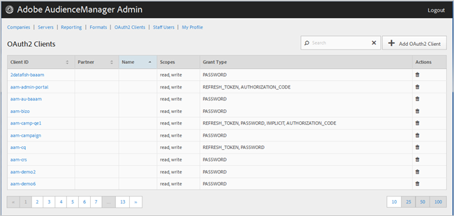

# OAuth2 클라이언트 {#oauth-clients}

사용 [!UICONTROL OAuth2 Clients] 목록을 보기 위한 페이지 [!UICONTROL OAuth2] 의 클라이언트 [!DNL Audience Manager] 구성. 적절한 사용자 역할이 할당되면 기존 클라이언트를 편집 또는 삭제하거나 새 클라이언트를 만들 수 있습니다.

## 개요 {#overview}

<!-- c_oauth.xml -->

>[!NOTE]
>
>고객이 [OAuth2](https://experienceleague.adobe.com/docs/audience-manager/user-guide/api-and-sdk-code/rest-apis/aam-api-getting-started.html#oauth) Audience Manager 사용 안내서의 설명서입니다.

[!DNL OAuth2] 은(는) 보안 위임된 액세스를 제공하기 위한 권한 부여에 대한 개방형 표준입니다. [!DNL Audience Manager] 리소스 소유자를 대신한 리소스.

원하는 열의 헤더를 클릭하여 각 열을 오름차순 또는 내림차순으로 정렬할 수 있습니다.

사용 [!UICONTROL Search] 원하는 클라이언트를 찾을 수 있도록 목록 하단의 상자 또는 페이지 매김 컨트롤입니다.

## OAuth2 클라이언트 만들기 또는 편집 {#create-edit-client}

<!-- t_create_edit_auth.xml -->

사용 [!UICONTROL OAuth2 Clients] Audience Manager의 페이지 [!UICONTROL Admin] 새로 만드는 도구 [!UICONTROL Oauth2] 클라이언트 또는 기존 클라이언트를 편집합니다.

1. 새로 만들려면 [!UICONTROL OAuth2] client, click **[!UICONTROL OAuth2 Clients]** > **[!UICONTROL Add OAuth2 Client]**. 기존 항목 편집하기 [!UICONTROL OAuth2] client에서 원하는 클라이언트를 클릭합니다 **[!UICONTROL Client ID]** 열.
1. 이에 대해 원하는 이름을 지정합니다 [!UICONTROL OAuth2] 클라이언트. 이 이름은 레코드에 대해서만 사용됩니다.
1. 다음을 지정합니다. [!UICONTROL OAuth2] 클라이언트의 이메일 주소. 이메일 주소는 한 개로 제한됩니다.
1. 다음에서 **[!UICONTROL Partner]** 드롭다운 목록에서 원하는 파트너를 선택합니다.
1. 다음에서 **[!UICONTROL Client ID]** 상자에서 원하는 ID를 지정합니다. 제출할 때 사용되는 값입니다. [!DNL API] 요청. 접두사는 을 선택한 후 입력을 시작하면 자동으로 채워집니다. [!UICONTROL Partner] 이전 단계의 드롭다운 목록에서 올바른 형식은 &lt; *`partner subdomain`*> - &lt; *`Audience Manager username`*>.
1. 선택 또는 선택 해제 **[!UICONTROL Restrict to Partner Users]** 원하는 대로 확인란을 선택합니다. 이 확인란을 선택하면 사용자는 [!DNL Audience Manager] 선택한 파트너에 대해 나열된 사용자입니다. 가장 좋은 방법은 이 옵션을 선택하는 것입니다.
1. 다음에서 **[!UICONTROL Scope]** 섹션, 선택 또는 선택 해제 **[!UICONTROL Read]** 및 **[!UICONTROL Write]** 원하는 대로 확인란
1. 다음에서 **[!UICONTROL Grant Type]** 섹션에서 원하는 인증 수단을 선택합니다. 의 기본 설정을 사용하는 것이 좋습니다 [!UICONTROL Password] 및 [!UICONTROL Refresh-token] 옵션.

   * **[!UICONTROL Implicit]**: 이 옵션을 선택하면 [!UICONTROL Redirect URI] 상자가 활성화되었습니다. 사용자는 인증된 후 자동 액세스 토큰을 받게 되고 즉시 리디렉션으로 전송됩니다 [!DNL URI].
   * **[!UICONTROL Authorization Code]**: 이 옵션을 선택하면 [!UICONTROL Redirect URI] 상자가 활성화되었습니다. 사용자는 인증된 후 클라이언트로 반환되고 리디렉션으로 전송됩니다 [!DNL URI].
   * **[!UICONTROL Password]**: 사용자는 인증 서버를 통한 자동 유효성 검사 시도가 아니라 사용자가 입력한 암호로 인증됩니다.
   * **[!UICONTROL Refresh_token]**: 만료된 액세스 토큰을 장기간 새로 고치는 데 사용됩니다.

1. 다음에서 **[!UICONTROL Redirect URI]** 상자, 원하는 항목 지정 [!DNL URI]. 이 옵션은 다음을 선택하는 경우에만 활성화됩니다. **[!UICONTROL Implicit]** 및 **[!UICONTROL Authorization_code]** 권한 부여 유형. 다음 **[!UICONTROL Redirect URI]** 상자를 사용하면 쉼표로 구분된 허용 값을 지정할 수 있습니다 [!DNL URI] 값. 다음 은 [!DNL URI] 클라이언트의 사용자는 다음에 대한 클라이언트를 승인한 후 로 리디렉션됩니다. [!DNL API] 액세스 권한.
1. 액세스 및 새로 고침 토큰 만료에 대해 원하는 만료 시간(초)을 지정합니다.

   * **[!UICONTROL Access Token Expiration Time]**: 액세스 토큰이 발급된 후 유효한 시간(초)입니다. 플랫폼 기본값(12시간)을 사용하려면 null일 수 있습니다. 또한 액세스 토큰이 만료되지 않았음을 나타내는 -1일 수도 있습니다.
   * **[!UICONTROL Refresh Token Expiration Time]**: 새로 고침 토큰이 발급된 후 유효한 시간(초)입니다. 플랫폼 기본값(30일)을 사용하려면 null일 수 있습니다.

1. 클릭 **[!UICONTROL Save]**.

삭제 방법 [!UICONTROL OAuth2] client, click **[!UICONTROL OAuth2 Clients]**&#x200B;을 클릭한 다음 을 클릭합니다   다음에서 **[!UICONTROL Actions]** 원하는 클라이언트에 대한 열입니다.

>[!MORELIKETHIS]
>
>* [API 요구 사항 및 권장 사항](../admin-oauth2/aam-admin-api-requirements.md)

