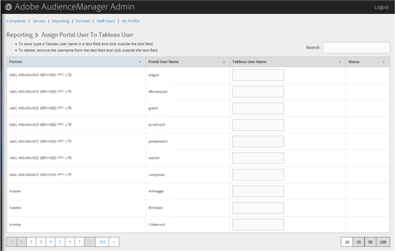

# 타블로 사용자에게 포털 사용자 할당 {#assign-a-portal-user-to-tableau-user}

<!-- t_tabeau.xml -->

페이지를 [!UICONTROL Reporting] 사용하여 포털 사용자를 [!DNL Tableau] 사용자로 만듭니다. 이를 통해 사용자는 Audience Manager에서 [!DNL Tableau] 보고서를 볼 수 있습니다.

1. **[!UICONTROL Reporting]****[!UICONTROL Assign Portal User to Tableau User]**&gt;를 클릭합니다.

   

1. 사용자를 할당하려면 원하는 파트너 행에 텍스트 필드에 [!DNL Tableau] 사용자 이름을 입력한 다음 텍스트 필드 외부를 클릭합니다.

사용자 등록을 삭제하려면 원하는 파트너 행에서 텍스트 필드에서 사용자 이름을 제거한 다음 텍스트 필드 외부를 클릭합니다.
