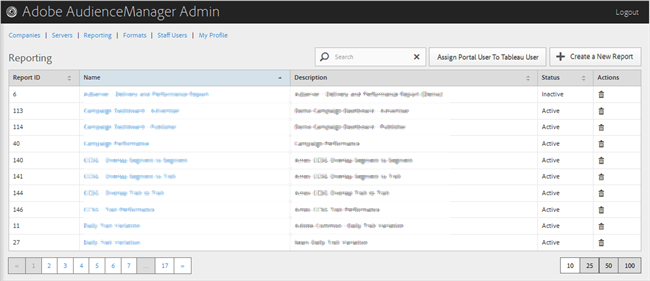

# 보고 {#reporting}

새 보고서를 만들거나 기존 보고서를 편집 또는 삭제하여 Audience Manager 보고서를 관리합니다. 포털 사용자를 다음으로 할당할 수도 있습니다. [!DNL Tableau] 사용자.

<!-- c_reporting.xml -->

원하는 열의 헤더를 클릭하여 각 열을 오름차순 또는 내림차순으로 정렬할 수 있습니다.

사용 [!UICONTROL Search] 원하는 보고서를 찾기 위해 목록 하단의 상자 또는 페이지 매김 컨트롤을 클릭합니다.
