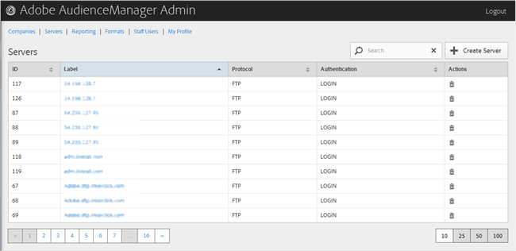

# 서버 삭제 {#delete-a-server}

Audience Manager 관리 도구의 [!UICONTROL Servers] 페이지를 사용하여 기존 서버를 삭제합니다.

<!-- t_delete_server.xml -->

>[!NOTE]
>
>기존 서버를 삭제하려면 [!UICONTROL DEXADMIN] 역할이 있어야 합니다.

1. 기존 서버를 삭제하려면 **[!UICONTROL Servers]**&#x200B;을 클릭합니다.

   

1. 원하는 서버의 **[!UICONTROL Actions]** 열에서 을 클릭합니다.
1. **[!UICONTROL OK]**&#x200B;을 클릭하여 삭제를 확인합니다.
