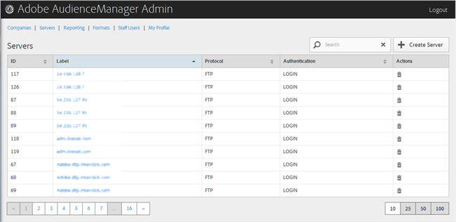

# 서버 개요 {#servers-overview}

Audience Manager 구성의 서버 목록을 보려면 [!UICONTROL Servers] 페이지를 사용하십시오. 적절한 사용자 역할이 할당되도록 기존 서버를 편집 또는 삭제하거나 새 서버를 만들 수 있습니다.

<!-- c_servers.xml -->

원하는 열의 헤더를 클릭하여 각 열을 오름차순이나 내림차순으로 정렬할 수 있습니다. 원하는 서버를 찾으려면 목록 하단에 있는 [!UICONTROL Search] 상자나 페이지 매김 컨트롤을 사용하십시오.