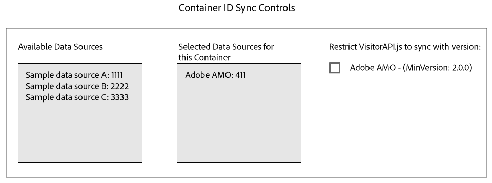

# Media Optimizer와 ID 동기화 {#id-syncing-with-media-optimizer}

기본적으로 모든 회사는 [!DNL Adobe Media Optimizer]([!DNL AMO])과 데이터를 동기화합니다. [!UICONTROL Admin UI]에서 각 회사 컨테이너에는 이 프로세스를 관리하는 데이터 소스가 있습니다. 이 데이터 소스는 [!UICONTROL Adobe AMO]([!UICONTROL ID] 411)입니다. 선택한 회사의 컨테이너 행([!UICONTROL Containers] 탭 아래)을 클릭하여 이 기본 동기화를 비활성화하거나 다른 데이터 소스를 [!DNL AMO] 동기화 프로세스에 추가 및 제거합니다.

## ID 동기화 상태 {#id-sync-status}

다음 표에서는 데이터 소스의 동기화 상태를 설명합니다.

| 상태 | 설명 |
|------ | -------- |
| 꺼짐 | [!DNL AMO]과(와) ID 동기화를 비활성화하려면 이 컨테이너에 대한 [!UICONTROL Selected Data Sources]에서 모든 데이터 소스를 제거합니다. |
| 설정(ID 서비스 버전에 관계 없음) | 데이터 소스는 다음과 같은 경우 ID 서비스 버전에 관계없이 [!DNL AMO]과 동기화됩니다. <ul><li>데이터 소스가 [!UICONTROL Selected Data Sources] 목록에 나타납니다.</li><li>[!DNL AMO] 확인란 *이(가) 선택되어 있지 않습니다.*</li></ul> |
| 설정(ID 서비스 버전에 관계 없음) | 다음과 같은 경우 데이터 소스는 [!DNL AMO]과(와) ID 서비스 버전 2.0(또는 이상)으로 동기화됩니다. <ul><li>데이터 소스가 [!UICONTROL Selected Data Sources] 목록에 나타납니다.</li><li>[!DNL AMO] 확인란 *이*&#x200B;이 선택되었습니다.</li></ul> |

>[!MORELIKETHIS]
>
>* [컨테이너 관리](../companies/admin-manage-containers.md#task_61DB5CEECC5049DD8D059C642AC3F967)

