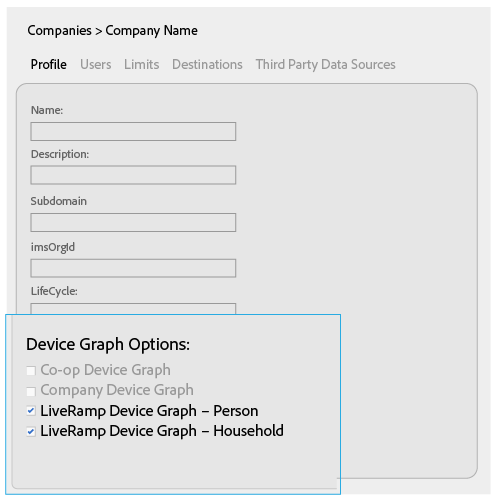
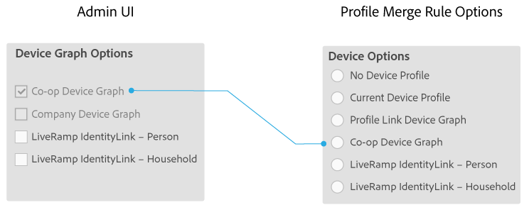
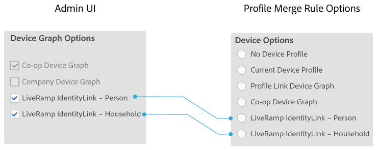

# 회사를 위한 장치 그래프 옵션 {#device-graph-options-for-companies}

다음 [!UICONTROL Device Graph Options] 에 참여하는 회사에서 사용할 수 있습니다. [!DNL Adobe Experience Cloud Device Co-op]. 고객이 또한 Audience Manager과 통합된 서드파티 장치 그래프 제공자와 계약 관계에 있는 경우 이 섹션에는 해당 장치 그래프에 대한 옵션이 표시됩니다. 이러한 옵션은에 있습니다. [!UICONTROL Companies] > 회사 이름 > [!UICONTROL Profile] > [!UICONTROL Device Graph Options].

이 그림에서는 타사 장치 그래프 옵션에 일반 이름을 사용합니다. 프로덕션에서 이러한 이름은 Device Graph 공급자에서 가져오며 여기에 표시된 것과 다를 수 있습니다. 예를 들어 [!DNL LiveRamp] 옵션은 일반적으로(항상 그런 것은 아님):

*  &quot;[!DNL LiveRamp]&quot;
* 다양한 가운데 이름 포함
* 다음으로 종료 &quot;[!UICONTROL - Household]&quot; 또는 &quot;[!UICONTROL -Person]&quot;

## 장치 그래프 옵션 정의됨 {#device-graph-options-defined}

여기에서 선택하는 장치 그래프 옵션이 다음을 노출하거나 숨깁니다. [!UICONTROL Device Options] 에서 사용할 수 있는 선택 사항 [!DNL Audience Manager] 고객이 다음을 만들 때 [!UICONTROL Profile Merge Rule].

### Co-op 장치 그래프 {#co-op-graph}

에 참여하는 고객 [Adobe Experience Cloud Device Co-op](https://experienceleague.adobe.com/docs/device-co-op/using/about/overview.html?lang=en) 다음 옵션을 사용하여 [!UICONTROL Profile Merge Rule] 포함 [결정론적 데이터 및 확률론적 데이터](https://experienceleague.adobe.com/docs/device-co-op/using/device-graph/links.html?lang=en). 다음 [!DNL Corporate Provisioning Team] 백 엔드를 통해 이 옵션을 활성화 및 비활성화합니다. [!DNL API] 호출합니다. 에서 이 상자를 선택하거나 선택 취소할 수 없습니다. [!DNL Admin UI]. 또한 **[!UICONTROL Co-op Device Graph]** 및 **[!UICONTROL Company Device Graph]** 옵션은 함께 사용할 수 없습니다. 고객은 둘 중 하나를 활성화하도록 요청할 수 있지만 둘 다 활성화하지는 않습니다. 선택하면 다음이 노출됩니다. **[!UICONTROL Co-op Device Graph]** 에서 컨트롤 [!UICONTROL Device Options] 다음에 대한 설정 [!UICONTROL Profile Merge Rule].

### 회사 장치 그래프 {#company-graph}

이 옵션은 다음에 대한 것입니다. [!DNL Analytics] 를 사용하는 고객 [!UICONTROL People] 지표 [!DNL Analytics] 보고서 세트입니다. 다음 [!DNL Corporate Provisioning Team] 백 엔드를 통해 이 옵션을 활성화 및 비활성화합니다. [!DNL API] 호출합니다. 에서 이 상자를 선택하거나 선택 취소할 수 없습니다. [!DNL Admin UI]. 또한 **[!UICONTROL Company Device Graph]** 및 **[!UICONTROL Co-op Device Graph]** 옵션은 함께 사용할 수 없습니다. 고객은 둘 중 하나를 활성화하도록 요청할 수 있지만 둘 다 활성화하지는 않습니다. 확인 시:

* 이 장치 그래프는 구성할 회사에 속하는 결정론적 데이터를 사용합니다(확률론적 데이터 없음).
* [!DNL Audience Manager] 자동으로 만들기 [!UICONTROL Data Source] 호출됨 `*`파트너 이름`*-Company Device Graph-Person`. 다음에서 [!UICONTROL Data Source] 세부 정보 페이지, [!DNL Audience Manager] 고객은 파트너 이름 및 설명을 변경하고 적용할 수 있습니다 [데이터 내보내기 제어](https://experienceleague.adobe.com/docs/device-co-op/using/device-graph/links.html?lang=en) 이 데이터 소스에 연결합니다.
* [!DNL Audience Manager] 고객 *금지* 에서 새 설정 보기 [!UICONTROL Device Options] 섹션에 대한 섹션 [!UICONTROL Profile Merge Rule].

### LiveRamp 장치 그래프(개인 또는 세대) {#liveramp-device-graph}

이러한 확인란은 [!DNL Admin UI] 파트너가 다음을 만들 때 [!UICONTROL Data Source] 및 선택 **[!UICONTROL Use as an Authenticated Profile]** 및/또는 **[!UICONTROL Use as a Device Graph]**. 이러한 설정에 대한 이름은 타사 장치 그래프 제공자에 의해 결정됩니다(예: [!DNL LiveRamp], [!DNL TapAd]등). 선택하면 구성하려는 회사에서 이러한 장치 그래프에서 제공하는 데이터를 사용하게 됩니다.

>[!MORELIKETHIS]
>
>* [정의된 프로필 병합 규칙 옵션](https://experienceleague.adobe.com/docs/audience-manager/user-guide/features/profile-merge-rules/merge-rule-definitions.html?lang=en)
>* [데이터 소스 설정 및 메뉴 옵션](https://experienceleague.adobe.com/docs/audience-manager/user-guide/features/data-sources/datasources-list-and-settings.html?lang=en)

