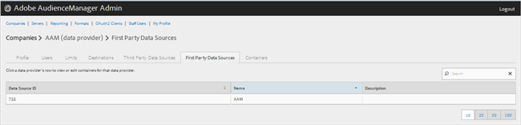
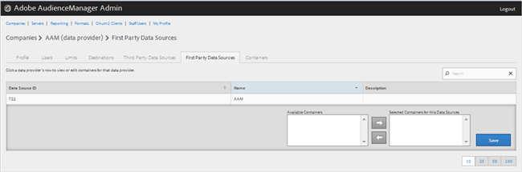

# 자사 데이터 공급자 관리 {#manage-first-party-data-providers}

자사 데이터 공급자에 대한 컨테이너 및 매핑을 보거나 편집합니다.

<!-- t_first_party_providers.xml -->

1. 클릭 **[!UICONTROL Companies]**&#x200B;를 클릭하고 원하는 회사를 찾아 클릭하여 해당 회사를 표시합니다 [!UICONTROL Profile] 페이지를 가리키도록 업데이트하는 중입니다. 사용 [!UICONTROL Search] 목록 하단의 상자 또는 페이지 매김 컨트롤을 사용하여 원하는 회사를 찾을 수 있습니다. 원하는 열의 헤더를 클릭하여 각 열을 오름차순 또는 내림차순으로 정렬할 수 있습니다.

1. 다음을 클릭합니다. **[!UICONTROL First Party Data Providers]** 탭.

   

1. 데이터 공급자의 행을 클릭하여 해당 데이터 공급자에 대한 컨테이너 및 매핑을 보거나 편집합니다.

   

1. 에서 컨테이너 이동 **[!UICONTROL Available Containers]** 및 **[!UICONTROL Selected Containers for This Data Provider]** 원하는 컨테이너를 선택한 다음 필요에 따라 오른쪽 또는 왼쪽 화살표를 클릭하여 나열합니다.
1. 클릭 **[!UICONTROL Save]** 변경 작업을 수행한 경우
