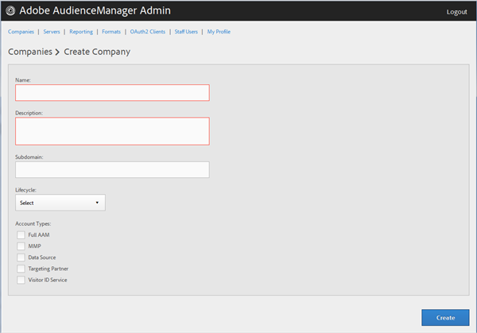
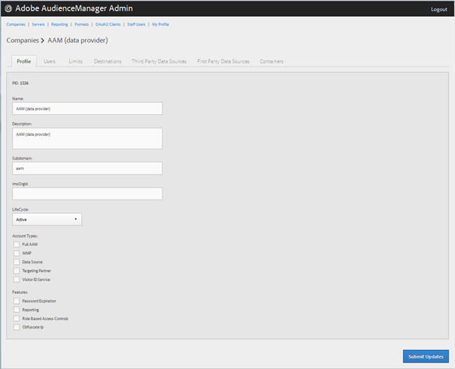
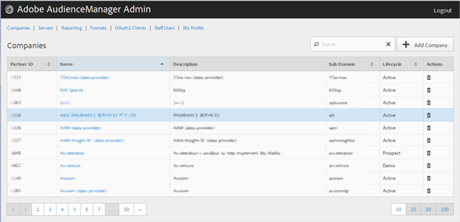

# 회사 프로필 만들기 {#create-a-company-profile}

Audience Manager 관리 도구의 [!UICONTROL Companies] 페이지를 사용하여 새 회사를 만듭니다.

<!-- t_create_company.xml -->

>[!NOTE]
>
>새 회사를 만들려면 **[!UICONTROL DEXADMIN]** 역할이 있어야 합니다.

1. 클릭 **[!UICONTROL Companies]** > **[!UICONTROL Add Company]**.
1. 다음 필드를 채웁니다.

   * **[!UICONTROL Name]**:(필수) 회사 이름을 지정합니다.
   * **[!UICONTROL Description]**:(필수) 산업 또는 회사 이름과 같은 회사에 대한 설명 정보를 제공합니다.
   * **[!UICONTROL Subdomain]**:(필수) 회사의 하위 도메인을 지정합니다. 입력한 텍스트는 이벤트 호출의 하위 도메인으로 표시됩니다. 이것은 변경할 수 없습니다. 올바른 문자열 [!DNL URL]이어야 합니다.

      예를 들어 회사 이름이 지정된 경우 하위 도메인 [!DNL AcmeCorp]이 [!DNL acmecorp]됩니다.

      Audience Manager은 [!UICONTROL Data Collection Server] (DCS)에 하위 도메인을 사용합니다. 앞의 예에서, 회사가 가득 찬 경우 [!DNL URL] 는 [!UICONTROL DCS] 입니다 [!DNL acmecorp.demdex.net].

   * **[!UICONTROL Lifecyle]**:회사에 대해 원하는 단계를 지정합니다.
      * **[!UICONTROL Active]**:회사가 활성 Audience Manager 클라이언트가 되도록 지정합니다. 계정은 컨설팅 [!UICONTROL Active] 고객뿐만 아니라 Audience Manager SKU에 대한 유료 고객을 의미합니다.
      * **[!UICONTROL Demo]**:데모 용도로만 사용하도록 지정합니다. 보고 데이터는 자동으로 위조됩니다.
      * **[!UICONTROL Prospect]**:회사가 잠재 Audience Manager 고객으로, 예를 들어 무료 또는 판매 데모를 위한 계정 설정 [!DNL POC] 을 받는 회사로 지정합니다.
      * **[!UICONTROL Test]**:회사가 내부 테스트 목적으로만 사용되도록 지정합니다.
   * **[!UICONTROL Account Types]**:이 회사에 대한 전체 계정 유형 세트를 지정합니다. 다른 모든 유형과 함께 사용할 수 있는 계정 유형은 없습니다.
      * **[!UICONTROL Full AAM]**:회사에 전체 Adobe Audience Manager 계정이 있고 사용자에게 로그인 액세스 권한이 부여되도록 지정합니다.
      * **[!UICONTROL MMP]**:회사가 [!UICONTROL Master Marketing Profile] ([!UICONTROL MMP]) 기능을 사용하도록 설정되었는지 지정합니다. 이 [!UICONTROL MMP] 를 사용하면 모든 방문자에게 [!UICONTROL Experience Cloud ID] ([!DNL MCID])를 할당한 다음 Audience Manager에서 사용하는 대상을 Experience Cloud에서 공유할 수 있습니다. 이 계정 유형을 선택하면 해당 계정 [!UICONTROL Experience Cloud ID Service] 도 자동으로 선택됩니다.

         자세한 내용은 대상 [서비스 - 기본 마케팅 프로필을 참조하십시오](https://marketing.adobe.com/resources/help/en_US/mcloud/audience_library.html).
   * **[!UICONTROL Data Source]**:회사가 Audience Manager 내의 타사 데이터 공급자로 지정합니다.
   * **[!UICONTROL Targeting Partner]**:회사가 Audience Manager 고객을 위한 타깃팅 플랫폼 역할을 하도록 지정합니다.
   * **[!UICONTROL Visitor ID Service]**:회사가 이 기능을 사용할 수 있도록 설정되었는지 지정합니다 [!UICONTROL Experience Cloud Visitor ID Service].

      이 [!UICONTROL Experience Cloud Visitor ID Service] 는 Experience Cloud 솔루션 간에 범용 방문자 ID를 제공합니다. For more information, see the [Experience Cloud Visitor ID Service user guide](https://marketing.adobe.com/resources/help/en_US/mcvid/mcvid-overview.html).

   * **[!UICONTROL Agency]**:회사에 [!UICONTROL Agency] 계정을 갖게 되도록 지정합니다.

1. 클릭 **[!UICONTROL Create]**. 회사 프로필 [편집의 지침에 따라 계속합니다](../companies/admin-manage-company-profiles.md#edit-company-profile).

   

## 회사 프로필 편집 {#edit-company-profile}

회사 이름, 설명, 하위 도메인, 라이프사이클 등을 포함하여 회사 프로필을 편집합니다.

<!-- t_edit_company_profile.xml -->

1. 을 **[!UICONTROL Companies]**&#x200B;클릭하고 원하는 회사를 찾아 클릭하여 해당 [!UICONTROL Profile] 페이지를 표시합니다.

   목록 맨 아래의 [!UICONTROL Search] 상자나 페이지 매김 컨트롤을 사용하여 원하는 회사를 찾습니다. 원하는 열의 헤더를 클릭하여 각 열을 오름차순이나 내림차순으로 정렬할 수 있습니다.

   

1. 필요에 따라 필드를 편집합니다. 

   * **[!UICONTROL Name]**:회사 이름을 편집합니다. 필수 필드입니다.
   * **[!UICONTROL Description]**:회사 설명을 편집합니다. 필수 필드입니다.
   * **[!UICONTROL Subdomain]**:(필수) 회사의 하위 도메인을 지정합니다. 입력한 텍스트는 이벤트 호출의 하위 도메인으로 표시됩니다. 이것은 변경할 수 없습니다. 올바른 문자열 [!DNL URL]이어야 합니다.

      예를 들어 회사 이름이 지정된 경우 하위 도메인 [!DNL AcmeCorp]이 [!DNL acmecorp]됩니다.

      Audience Manager은 [!UICONTROL Data Collection Server] (DCS)에 하위 도메인을 사용합니다. 앞의 예에서, 회사가 가득 찬 경우 [!DNL URL] 는 [!UICONTROL DCS] 입니다 [!DNL acmecorp.demdex.net].

   * **[!UICONTROL imsOrgld]**:([!UICONTROL Identity Management System Organization ID]이 ID를 사용하면 회사를 Adobe Experience Cloud과 연결할 수 있습니다.
   * **[!UICONTROL Lifecyle]**:회사에 대해 원하는 단계를 지정합니다.
      * **[!UICONTROL Active]**:회사가 활성 Audience Manager 클라이언트가 되도록 지정합니다. 활성 계정은 컨설팅 목적뿐만 아니라 Audience Manager SKU에 대한 유료 고객을 의미합니다.
      * **[!UICONTROL Demo]**:데모 용도로만 사용하도록 지정합니다. 보고 데이터는 자동으로 위조됩니다.
      * **[!UICONTROL Prospect]**:회사가 잠재 Audience Manager 고객으로, 예를 들어 무료 또는 판매 데모를 위한 계정 설정 [!DNL POC] 을 받는 회사로 지정합니다.
      * **[!UICONTROL Test]**:회사가 내부 테스트 목적으로만 사용되도록 지정합니다.
   * **[!UICONTROL Account Types]**:이 회사에 대한 전체 계정 유형 세트를 지정합니다. 다른 모든 유형과 함께 사용할 수 있는 계정 유형은 없습니다.
      * **[!UICONTROL Full AAM]**:회사에 전체 Adobe Audience Manager 계정이 있고 사용자에게 로그인 액세스 권한이 부여되도록 지정합니다.
      * **[!UICONTROL MMP]**:회사가 마케팅 프로필(기본) 기능을 사용할 수 있도록 설정되었는지 지정합니다.[!UICONTROL MMP]

         이 계정 유형을 선택하면 **[!UICONTROL Visitor ID Service]** 도 자동으로 선택됩니다.
자세한 내용은 대상 [서비스 - 기본 마케팅 프로필을 참조하십시오](https://marketing.adobe.com/resources/help/en_US/mcloud/audience_library.html).
   * **[!UICONTROL Data Source]**:회사가 Audience Manager 내의 타사 데이터 공급자로 지정합니다.
   * **[!UICONTROL Targeting Partner]**:회사가 Audience Manager 고객을 위한 타깃팅 플랫폼 역할을 하도록 지정합니다.
   * **[!UICONTROL Visitor ID Service]**:회사가 Experience Cloud 방문자 ID 서비스를 사용할 수 있도록 설정되었는지 지정합니다.

      Experience Cloud 방문자 ID 서비스는 Experience Cloud 솔루션 전반에 유니버설 방문자 ID를 제공합니다. For more information, see the [Experience Cloud Visitor ID Service user guide](https://microsite.omniture.com/t2/help/en_US/mcvid/mcvid_service.html).

   * **[!UICONTROL Agency]**:회사에 에이전시 계정을 갖게 되도록 지정합니다.
   * **[!UICONTROL Features]**: 원하는 옵션을 선택합니다:
      * **[!UICONTROL Password Expiration]**:Audience Manager 보안을 강화하기 위해 이 회사 내의 모든 사용자 암호가 90일 후 만료되도록 설정합니다.
      * **[!UICONTROL Reporting]**:이 회사에 대한 Audience Manager 보고를 활성화합니다.
      * **[!UICONTROL Role Based Access Controls]**:이 회사에 대한 역할 기반 액세스 제어를 활성화합니다. 역할 기반 액세스 컨트롤을 사용하면 액세스 권한이 다른 사용자 그룹을 만들 수 있습니다. 그런 다음 이러한 그룹 내의 개별 사용자는 Audience Manager의 특정 기능에만 액세스할 수 있습니다.

1. 클릭 **[!UICONTROL Submit Updates]**.

## 회사 프로필 삭제 {#delete-company-profile}

Audience Manager 도구 [!UICONTROL Companies] 의 페이지를 사용하여 기존 회사를 [!UICONTROL Admin] 삭제합니다.

<!-- t_delete_company.xml -->

>[!NOTE]
>
>기존 회사를 삭제하려면 해당 [!UICONTROL DEXADMIN] 역할이 있어야 합니다.

1. 기존 회사를 삭제하려면 을(를) 클릭합니다 **[!UICONTROL Companies]**.

   

1. 원하는 회사  의 **[!UICONTROL Actions]** 열에서 을 클릭합니다.
1. Click **[!UICONTROL OK]** to confirm the deletion.
