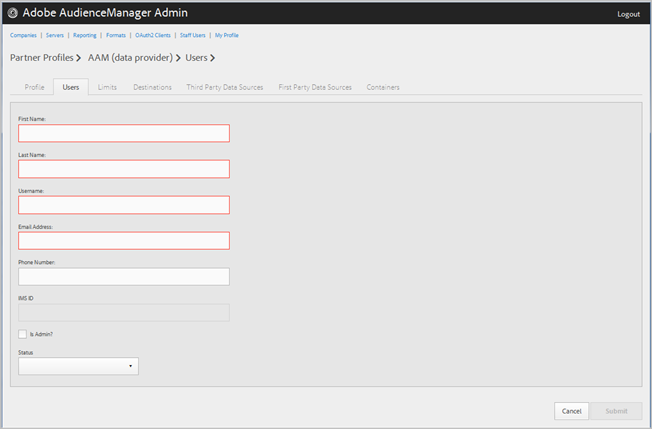

# 회사 사용자 관리 {#manage-company-users}

새 Audience Manager 사용자를 만들거나 기존 사용자를 편집하고 삭제합니다.

<!-- t_manage_company_users.xml -->

1. 을 클릭하고 **[!UICONTROL Companies]**&#x200B;원하는 회사를 찾아 클릭하여 [!UICONTROL Profile] 해당 페이지를 표시합니다.

   목록 아래쪽의 [!UICONTROL Search] 상자 또는 페이지 매김 컨트롤을 사용하여 원하는 회사를 찾습니다. 원하는 열의 헤더를 클릭하여 오름차순 또는 내림차순으로 각 열을 정렬할 수 있습니다.
1. **[!UICONTROL Users]** 탭을 클릭합니다.
1. 새 사용자를 만들려면 **[!UICONTROL Create a New User]**&#x200B;을 클릭합니다. 기존 사용자를 편집하려면 **[!UICONTROL Username]** 열에서 원하는 사용자를 찾아 클릭합니다.

   

1. 다음 필드를 채웁니다.

   * **[!UICONTROL First Name]**: (필수) 사용자의 이름을 지정합니다.
   * **[!UICONTROL Last Name]**: (필수) 사용자의 성을 지정합니다.
   * **[!UICONTROL Username]**: (필수) 사용자의 Audience Manager 사용자 이름을 지정합니다. 사용자 이름은 고유해야 합니다.
   * **[!UICONTROL Email Address]**: (필수) 사용자의 이메일 주소를 지정합니다.
   * **[!UICONTROL Phone Number]**: 사용자의 전화 번호를 지정합니다.
   * **[!UICONTROL IMS ID]**: [!UICONTROL Identity Management System ID]사용자. 이 ID를 사용하면 Adobe 솔루션에 Adobe 솔루션에 연결할 수 있습니다.
   * **[!UICONTROL Is Admin]**: 이 사용자를 Audience Manager 관리 사용자로 지정합니다. 관리자에게는 이 파트너에 대한 모든 Audience Manager 사용자 역할이 있습니다.
   * **[!UICONTROL Status]**: 새 사용자를 만드는 동안 이 필드는 처음 사용자가 로그인하고 임시 암호를 재설정할 **[!UICONTROL Pending]** 때까지 표시됩니다. 기존 사용자를 편집하는 경우 다음 상태 중에서 선택할 수 있습니다.
      * **[!UICONTROL Active]**: 이 사용자가 활성 Audience Manager 사용자임을 지정합니다.
      * **[!UICONTROL Deactivated]**: 이 사용자가 비활성화된 Audience Manager 사용자임을 지정합니다.
      * **[!UICONTROL Expired]**: 이 사용자가 만료된 사용자임을 지정합니다.
      * **[!UICONTROL Locked Out]**: 이 사용자가 잠겨 있는 사용자임을 지정합니다.

1. 클릭 **[!UICONTROL Submit]**.

## 사용자 삭제 {#delete-user}

사용자를 삭제하려면:

1. 을 클릭하고 **[!UICONTROL Companies]**&#x200B;원하는 회사를 찾아 클릭한 다음 **[!UICONTROL Users]** 탭을 클릭합니다.
1. 원하는  사용자의 **[!UICONTROL Actions]** 열을 클릭합니다.
1. Click **[!UICONTROL OK]** to confirm the deletion.