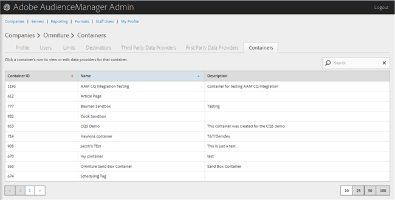
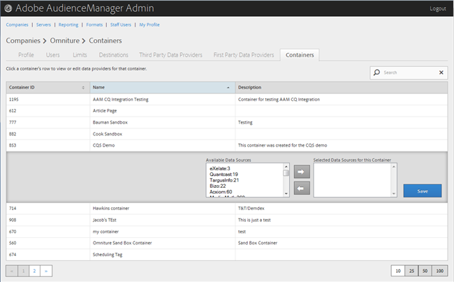

# 컨테이너 관리 {#manage-containers}

컨테이너의 데이터 공급자를 보거나 편집합니다.

<!-- t_containers.xml -->

>[!NOTE]
>
>기본적으로 회사는 하나의 컨테이너로 생성됩니다. 사용자 인터페이스의 회사에 대해 추가 컨테이너를 만들 수 있습니다. **[!UICONTROL Tools > Tags]**.

1. 클릭 **[!UICONTROL Companies]**&#x200B;를 클릭하고 원하는 회사를 찾아 클릭하여 해당 회사를 표시합니다 [!UICONTROL Profile] 페이지를 가리키도록 업데이트하는 중입니다.

   사용 [!UICONTROL Search] 목록 하단의 상자 또는 페이지 매김 컨트롤을 사용하여 원하는 회사를 찾을 수 있습니다. 원하는 열의 헤더를 클릭하여 각 열을 오름차순 또는 내림차순으로 정렬할 수 있습니다.

1. 다음을 클릭합니다. **[!UICONTROL Containers]** 탭.

   

1. 컨테이너의 행을 클릭하여 해당 컨테이너의 데이터 공급자를 보거나 편집합니다.

   

1. 에서 데이터 소스 이동 **[!UICONTROL Available Data Sources]** 및 **[!UICONTROL Selected Data Sources for This Container]** 원하는 데이터 소스를 선택한 다음 필요에 따라 오른쪽 또는 왼쪽 화살표를 클릭하여 목록을 만듭니다.

   다음 위치에서 이 작업을 수행할 수도 있습니다. [타사 데이터 공급자](../companies/admin-third-party-providers.md#task_E942DD674D794BA6B8EFD52FD866E689)페이지를 가리키도록 업데이트하는 중입니다.

1. 클릭 **[!UICONTROL Save]** 변경 작업을 수행한 경우

>[!MORELIKETHIS]
>
>* [Media Optimizer와 ID 동기화](../companies/admin-amo-sync.md#concept_2B5537233DAA4860B3503B344F937D83)

