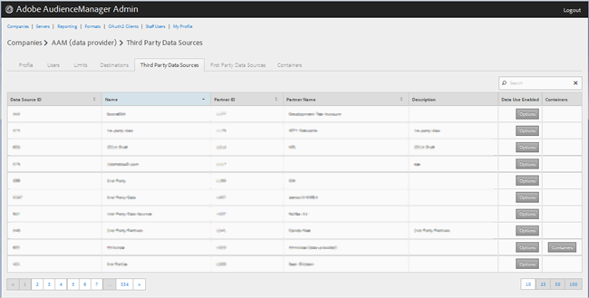
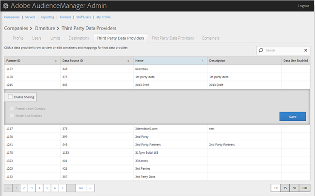

# 타사 데이터 공급자 관리 {#manage-third-party-data-providers}

타사 데이터 공급자에 대한 컨테이너 및 매핑을 보거나 편집합니다. 다른 데이터 공급자와의 공유를 활성화할 수도 있습니다.

1. 을 **[!UICONTROL Companies]**&#x200B;클릭하고 원하는 회사를 찾아 클릭하여 해당 [!UICONTROL Profile] 페이지를 표시합니다.

   목록 맨 아래의 [!UICONTROL Search] 상자나 페이지 매김 컨트롤을 사용하여 원하는 회사를 찾습니다. 원하는 열의 헤더를 클릭하여 각 열을 오름차순이나 내림차순으로 정렬할 수 있습니다.
1. Click the **[!UICONTROL Third Party Data Providers]** tab.

   

1. 데이터 공급자의 행을 클릭하여 해당 데이터 공급자에 대한 컨테이너 및 매핑을 보거나 편집합니다.

   

1. 다음 옵션 **[!UICONTROL Enable Sharing]** 을 활성화하려면 선택합니다.

   * **파트너 수준 겹침:**
   * **모델 사용 활성화:** 이 회사가 알고리즘 모델을 만들 때 이 데이터 공급자를 사용할 수 있도록 해줍니다.

   공유를 활성화하면 이 데이터 공급자로부터 트레이트에 액세스할 수 있습니다.

1. (조건부) 이 공급자에 대해 컨테이너가 활성화되어 있으면 원하는 컨테이너를 사용 가능한 목록에서 선택한 목록으로 이동하여 이 데이터 공급자에 대한 컨테이너를 선택할 수 있습니다.

   컨테이너 [페이지에서 이 작업을 수행할 수도](../companies/admin-manage-containers.md#task_61DB5CEECC5049DD8D059C642AC3F967) 있습니다.
1. 변경한 **[!UICONTROL Save]** 경우 을 클릭합니다.