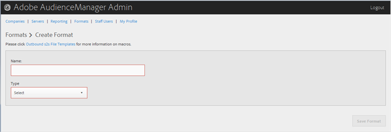

# 형식 만들기 또는 편집 {#create-or-edit-a-format}

Audience Manager 관리 도구의 [!UICONTROL Formats] 페이지를 사용하여 새 형식을 만들거나 기존 형식을 편집합니다.

<!-- t_create_format.xml -->

>[!TIP]
>
>아웃바운드된 데이터의 형식을 선택할 때는 기존 형식을 다시 사용하는 것이 좋습니다. 이미 검증된 형식을 사용하면 아웃바운드 데이터가 성공적으로 생성됩니다. 기존 형식의 형식을 정확하게 확인하려면 메뉴 모음에서 [!UICONTROL Formats] 옵션을 클릭하고 이름이나 ID 번호로 형식을 검색합니다. 형식이 잘못된 형식 또는 매크로가 잘못된 형식으로 출력되거나 정보가 완전히 출력되지 않도록 합니다.

1. 새 형식을 만들려면 **[!UICONTROL Formats]** &gt; **[!UICONTROL Add Format]**&#x200B;을 클릭합니다. 기존 형식을 편집하려면 **[!UICONTROL Name]** 열에서 원하는 형식을 클릭합니다.

   

1. 다음 필드를 채웁니다.
   * **** 이름:(필수) 형식을 설명하는 이름을 제공합니다.
   * **** 유형:(필수) 원하는 형식을 선택합니다.
      * **[!UICONTROL File]**:파일을 통해 데이터를 [!DNL FTP] 전송합니다.
      * **[!UICONTROL HTTP]**:데이터를 [!DNL JSON] 래퍼에 포함합니다.

1. (조건부) 선택한 **[!UICONTROL File]**&#x200B;경우 필드를 채웁니다.

   >[!NOTE]
   >
   >사용 가능한 매크로 목록은 파일 형식 [매크로](../formats/file-formats.md#concept_A867101505074418A58DE325949E5089) 및 HTTP 형식 [매크로를 참조하십시오](../formats/web-formats.md#reference_C392124A5F3F42E49F8AADDBA601ADFE).

   * **[!UICONTROL File Name]** :데이터 전송 파일의 파일 이름을 지정합니다.
   * **** 머리글:데이터 전송 파일의 첫 번째 행에 표시되는 텍스트를 지정합니다.
   * **[!UICONTROL Data Row]** :파일의 각 아웃바운드된 행에 표시되는 텍스트를 지정합니다.
   * **[!UICONTROL Maximum File Size (In MB)]** :데이터 전송 파일의 최대 파일 크기를 지정합니다. 압축된 파일은 100MB보다 작아야 합니다. 압축되지 않은 파일 크기에는 제한이 없습니다.
   * **[!UICONTROL Compression]** :원하는 압축 유형을 선택합니다.gz 또는 zip을 사용할 수 있습니다. 전달하려면 [!UICONTROL AWS S3].gz 또는 압축 해제된 파일을 사용해야 합니다.
   * **[!UICONTROL .info Receipt]** :전송 제어([!DNL .info]) 파일이 생성되도록 지정합니다. 이 [!DNL .info] 파일은 파트너가 Audience Manager가 파일 전송을 올바르게 처리했는지 확인할 수 있도록 파일 전송에 대한 메타데이터 정보를 제공합니다. 자세한 내용은 로그 파일 [전송에 대한 파일 전송을 참조하십시오](https://marketing.adobe.com/resources/help/en_US/aam/c_s2s_add_transfer_control_files.html).
   * **[!UICONTROL MD5 Checksum Receipt]** :체크섬 영수증이 생성되도록 [!DNL MD5] 지정합니다. 파트너가 Audience Manager가 전체 전송을 올바르게 처리했는지 확인할 수 있도록 체크섬 영수증. [!DNL MD5]

1. (조건부) 선택한 **[!UICONTROL HTTP]**&#x200B;경우 필드를 채웁니다.

   * **[!UICONTROL Method]** :이전 프로세스에 사용할 [!DNL API] 방법을 선택합니다.
      * **[!UICONTROL POST]** :선택하는 [!DNL POST]경우 컨텐츠 유형([!DNL XML] 또는 [!DNL JSON])을 선택한 다음 요청 본문을 지정합니다.
      * **[!UICONTROL GET]** :선택하는 [!DNL GET]경우 쿼리 매개 변수를 지정합니다.

1. 새 형식을 만드는 **[!UICONTROL Create]** 경우 을 클릭하고 기존 형식을 편집하는 **[!UICONTROL Save Updates]** 경우 을 클릭합니다.

## 형식 삭제 {#delete-format}

1. 클릭 **[!UICONTROL Formats]**.
2. 원하는  형식의 **[!UICONTROL Actions]** 열을 클릭합니다.
3. Click **[!UICONTROL OK]** to confirm the deletion.
