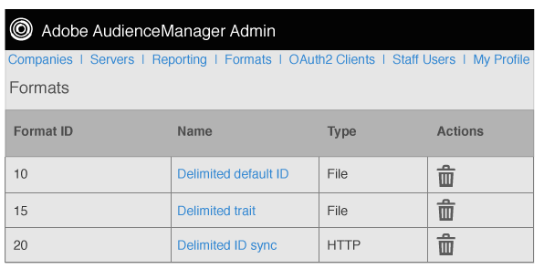

# 포맷 개요 {#formats-overview}

형식은 매크로를 사용하여 대상으로 전송된 데이터의 내용을 구성하는 저장된 템플릿(또는 파일)입니다. 형식 유형에는 [!DNL HTTP] 형식과 파일 형식이 포함됩니다. [!DNL HTTP] 형식 [!DNL JSON] 또는 [!DNL POST] [!DNL GET] 메서드를 사용하여 개체에 데이터를 보냅니다. 파일 포맷을 사용하면 데이터를 파일로 보낼 수 있습니다 [!DNL FTP]. 각 형식에서 사용하는 매크로는 파일 이름을 설정하고, 파일 헤더를 정의하며, 데이터 파일의 내용을 구성할 수 있습니다. 관리자에서 [!DNL UI]고객의 대상을 설정할 때 형식을 만들고 저장하고 다시 사용할 수 있습니다.

